# 学习目的和学习方法

好的算法对编程的意义
>编写程序解决问题，所编写的程序就是算法。好的算法就是在解决同一个编程问题的情况下，可以更加的节约硬件资源，也就是说使计算速度更快。

目的
>学会根据编程问题，设计一个好的算法，并且对设计的算法进行分析验证，是否为一个好的算法

# 算法的基本知识

## 算法的理解和性质

算法的理解
>对于给定的问题， 1个计算机算法就是用计算机求解这个问题的方法．一般来说，算法 由有限条指令构成，每条指令规定了计算机所要执行的有限次运算或者操作．


算法的性质
>主要有有穷性、确定性、可行性
>
>有穷性
>算法必须在有限个计算步骤后终止
>
>确定性
>算法必须是没有歧义的
>
>可行性
>每一个动作都能够被精准地机械执行


## 伪代码

### 伪码的基础知识
伪代码的理解
>伪代码(Pseudocode)是一种算法描述语言。使用伪代码的目的是为了使被描述的算法可以容易地以任何一种编程语言(Pascal, C, Java, etc)实现。因此，伪代码必须结构清晰，代码简单，可读性好，并且类似自然语言。


### 伪码的表示
算法伪码描述
>
>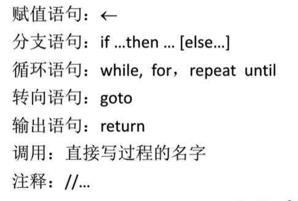


伪码里的变量声明
>变量不需声明，但都相当于是所在函数内部的局部变量，不能不加显示的说明就使用全局变量；


伪代码里的程序块的理解
>伪代码用缩进表示程序块 。
>表示程序中的分支程序结构，同一模块的语句有相同的缩进量，次一级模块的语句相对与其父级模块的语句缩进；


伪码的常用运算符
>`算术表达式可以使用通常的算术运算符（+，-，*，/，以及表示幂的^）。逻辑表达式可以使用关系运算符=,≠,<,≤和≥，以及逻辑运算符与(and),或（or），非（not）。`

伪码里的mod运算符
>MOD，是一个数学运算符号。a mod b=c，表明a除以b余数为c


赋值语句的伪码表示
>赋值语句用符号←表示，x←exp表示将exp的值赋给x，其中x是一个变量，exp是一个与x同类型的变量或表达式（该表达式的结果与x同类型）；多重赋值i←j←e是将表达式e的值赋给变量i和j，这种表示与j←e和i←e等价。

内容交换的伪码表示
>若a和b都是变量、数组项，那么记号a<->b 表示a和b的内容进行交换。

数组的伪码表示
>A[j]指示数组A的第j个元素。符号“ …”用来指示数组中值的范围。例如：
>A[1…j]表示含元素A[1], A[2], … , A[j]的子数组；


注释的伪代码表示
>因为伪代码属于类C语言，所以注释采用C语言中的 “// ”


输出语句的伪码表示
>输出出语句由关键字return后面跟随着输出变量或函数值等构成.当在循环体内遇到输出语句时,不管是否满足循环的条件,算法将停止进一步的迭代,立刻进行输出,然后算法停止运行.

### 伪代码的if语句


形式1

```
if c
then s
//C是逻辑表达式，S是执行语句
```


形式2

```
if c
then S1
	 S2
else S3
	 S4
	
//如果在一个if语句的一个选项里，有很多执行语句，比如形式2的第一个if选项 有S1,S2，可以把S2缩进的写在下一行表示。表示与S1一样，都是then后的执行语句。没有缩进的写在下一行，则表示不是if的执行语句，而是其他语句。 既缩进可以表示同一个程序块
```


形式3
```
if C

then S

else if C2

then  S2

.

.

.

else Sn
```


### 伪代码的whie语句

形式
```
while c do
	S1
	S2
S3
//C是逻辑表达式。S是执行语句，且while里的语句得用缩进表示。当C为真执行 S1 S2。C为假的时候，执行S3
```


### 伪代码的for语句

形式1
```
for i<-0 to 1 do
	S1
	S2

//相当于C++
for(i=0;i＜=1;i++)
{
	S1;
	S2;
}

```


形式1
```
for i<-n to 0 do
	S1
	S2


```


## 时间复杂度
### 时间复杂度的基础知识

时间复杂度的理解
>时间复杂度是用来描述算法运行时间、运行规模的一个式子
>时间复杂度越高，算法运行时间规模更大
>
>可以理解把时间复杂度看成是评估一个算法运行时间的单位。
>比如人睡觉是以小时为单位，烧一壶水是以分钟单位，飞船从地球飞出太阳系是以年为单位。通过这件事的时间单位，我们就可以大概知道这件事的时间规模。同理时间复杂度可以看成，算法运行时间的单位，我们可以通过时间复杂度知道大概的运行时间规模。

问题规模
>算法的问题规模通常是指算法需要处理的问题的输入数据的大小或数量。这个问题规模可以用各种不同的度量方式来表示，比如输入数据的长度、元素个数、矩阵的行数和列数等等，具体取决于具体的算法和问题。

问题规模和时间复杂度的关系
>在算法分析中，问题规模通常被用来估计算法的时间复杂度和空间复杂度。时间复杂度描述了算法运行所需的时间量，而空间复杂度描述了算法在执行期间需要使用的内存量。通常来说，随着问题规模的增加，算法的时间和空间复杂度也会相应增加。


常见时间复杂度和其比较
>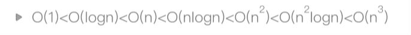
>

### 时间复杂度的计算规定

一次基础操作的时间复杂度用`O(1)`表示
> 一次加、减、乘、除、打印这种基本的操作，可以认为计算机的执行次数为1，则的时间复杂度用`O(1)`表示。举例如下
> 
>代码是一次打印操作，可以认为计算机的行次数为1则的时间复杂度用`O(1)`表示。
>
>


只取最高次数的n作为时间复杂度。
>例子1
> 
> 其时间复杂度为`O(n)`
> 例子循环执行（n-i）次循环的操作，每一次操作都是`O(1)`，也就是说原本时间复杂度应该为`（n-i）*O(1)`=`O(n-i)`
>但是时间复杂度不是`O(n-i)`，而是`O(n)`，我们只取最高次数的n作为时间复杂度，i可以看为`i*n的0次方。`
>
>例子2
> 
>其时间复杂度为`O（n^2）`
>例子循环执行(n-i)(n-j)次操作,最高次为n^2，我们只取最高次数的n因此我们用`O(n^2)`表示
>
>例子3
> 
>其时间复杂度为`O（n^3）`

只取最高次数的n作为时间复杂度的原因
>以生活为例，我们更常说说睡一觉是几小时，而不会说睡一觉是几小时零几分。   所以在同一个算法当中 ，有多个时间复杂度相加，我们只取次数最大的那一个。

时间复杂度的常数系数为1 
>例子
> 
>其时间复杂度为`O(1)`
>3次基础操作，每次操作的时间复杂度`O(1)`
>就是说原本时间复杂度应该为3*`O(1)`=`O(3)`，而由于规定，时间复杂度的常数系数为1，所以只能其时间复杂度只能是`O(1)`


时间复杂度的常数系数为1的原因
>之前说过时间复杂度可以理解为是评估一个算法运行时间的单位  ，`O(1)`就是表示执行基本操作的运行时间单位。而在生活中，我们说烧一壶水所花费的时间是几分钟，却不会说烧两壶水是两个几分钟，而也是用几分钟表示烧两壶水。所以在同一个算法当中，有多个相同的时间复杂度，不能把这些时间复杂度加起来，以此来合并系数，而是应该只用其中一个表示该算法时间复杂度
>

时间复杂度`O(1)`的理解
>在上面的规定下，时间复杂度的`O(1)`表示算法的运行时间是一个常数。也就是说，无论输入数据的规模如何增加，算法的执行时间都不会改变，始终为一个固定的值。

### 时间复杂度的计算方式
时间复杂度的计算方式的总结
>先计算大概运行多少次，以为n的式子表示。
>然后让式子常数系数都为1
>只取最高次数的n。

快速判断一个算法的时间复杂度的方法
>
快速判断一个算法的时间复杂度
确定问题规模n
一般k层关于n的循环，都是O（n的k次方）
问题规模减半都是O（logn）


举例1
> 
>时间复杂度为`O(n^2)`

举例2
>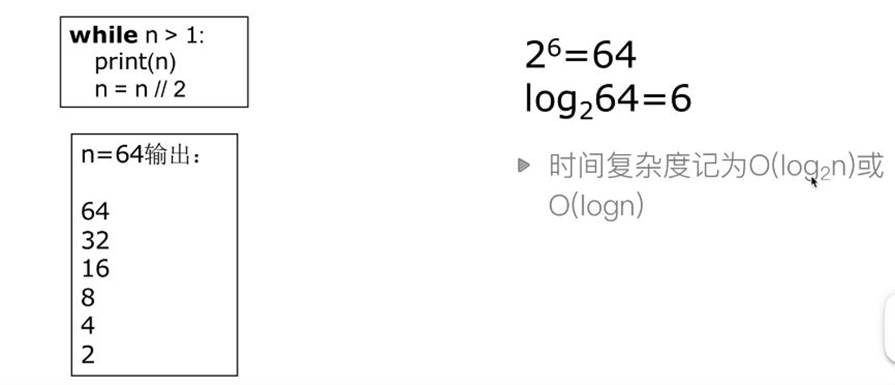


## 空间复杂度


空间复杂度的理解
>空间复杂度是描述了算法在执行期间需要使用的内存量的式子。


常见空间复杂度
>
>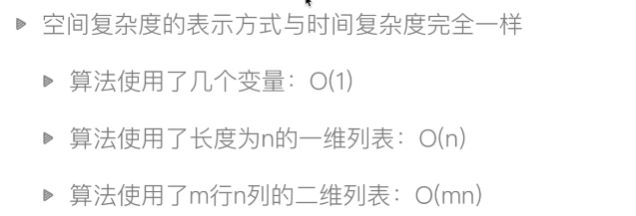
>当递归深度为 d 时，递归函数的空间复杂度为 O(d)，即需要 d 个栈帧来保存每次函数调用的相关信息。因此，在设计递归函数时，需要注意控制递归深度，避免出现栈溢出等问题。

算法的规则
>大部分算法有一个规则，空间换时间，我这个算法宁愿占用更多内存，也要尽量的运行时间更快。（时间比内存值钱。）

# 递归算法

递归算法组成
>结束条件
>调用自身

怎么去看懂递归函数
>要用宏观的思维，整体的思维去理解，不要用陷入每次递归的具体细节。
>也就是说在写递归函数的，只需要思考递归函数，要传入什么值，然后获得什么效果，以此来写递归过程，然后最终考虑结束条件即可。
>总的来说分为三步
>1.  看结束条件：递归算法中必须有一个基本情况，它不需要再次递归调用自身，并且可以直接得出结果。因此，快速看懂一个递归算法的关键是要通过结束条件找出这个基本情况。
>2. 确定递归调用：在基本情况之外，递归算法必须调用自身来解决子问题。因此，需要理解递归调用的方式和参数传递的方式。
>3. 确定返回值：递归算法中必须确定正确的返回值，以便最终得到正确的解决方案。在递归调用结束后，需要将结果合并或处理成最终的结果。
>

递归函数的判断举例
>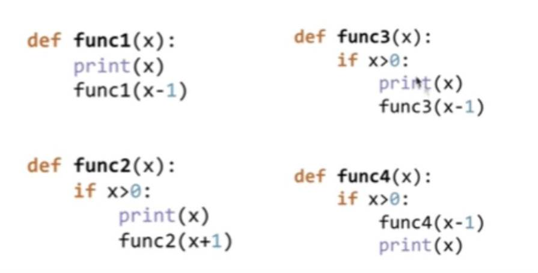
>func1 不是递归算法，因为没有结束条件
>func2不是递归算法，因为没有结束条件
>func3是递归算法.如果传入3，则输出3 2 1
>func4是递归算法.如果传入3，则输出1 2 3

# 查找

## 查找基本知识

查找
>在算法中，查找是指在一个数据集合中查找一个特定的元素或值。好的查找算法能更快的查找到所需要的元素或值，从而提高代码的运行效率。

查找的输入输出
>从列表中查找指定元素。
>输入:列表、待查找元素。
>输出︰元素下标(未找到元素时一般返回None或-1)

## 顺序查找

### 顺序查找的基本知识

顺序查找的理解
>也叫线性查找，从列表第一个元素开始，顺序进行搜索,直到找到元素或搜索到列表最后一个元素为止。

### 顺序查找的实现

代码


```

#include<iostream>
using namespace std;

//顺序查找的函数，a是要查的列表，n是列表长度，x是要查找的值，返回值是查找的值的下标。
int SequentialSearch(int *a,const int n, const int x);

//主函数，测试函数
int main()

{

	int m[] = {2,4,6,8,0,1,3,5,7,9};

	int result;

	int num = 7;

	result = SequentialSearch(m,10,num);

	if(result==-1) cout<<"没找到！"<<endl;

	else cout<<"在m["<<result<<"]里找到"<<num<<endl;

	system("pause");

	return 0;

}

//顺序查找函数的实现
int SequentialSearch(int *a,const int n, const int x)
{

	int i;

	//循环n次查找num

	for(i = 0;i<n;i++)

	{

		if(a[i]==x)

		return i;

	}

if(i==n) return -1;

}

时间复杂度为O（n）
```


## 二分查找
### 二分查找的基本知识
二分查找的理解
>假设有一段单调递增序列。
>取序列数据的中间值 A ，将 A 与要找的值 X 作比较，然后，
>if(A == X)  查找完毕,获取查找的值的下标；
>else if(A < X) ，就将单调序列的前一半舍去，以 A 为单调序列起点，重复取序列中间站操作；
>else if(A > X) ，就将单调序列的后一半舍去，以 A 为单调序列终点，重复取序列中间站操作；

二分查找查找列表中实数3的举例
>
>
>假设有一个单调递增序列，如上图，中间两个数字先暂时隐藏。
>left为数组下标 0
>right为数组下标n-1=8
>
>
>mid为中间值下标
>mid=(left+right)/2=4.
>得到中间值的下标4，中间值为5。 5>3,右边舍去留下左边候选区。
>
>
>right=mid-1=3
>
>
>mid=(left+right)/2=1
>得到中间值下标1，中间值为2。 2<3,舍去左边，留下右边的候选区
>
>
>left=mid+1=2
>
> 
>假设列表的值如上图，此时可以正常查到要查的值。
>mid=(left+right)/2=2
>得到中间值下标2，中间值为 3，则找列表中实数3的下标为2.
>
>
>假设列表值如上图，此时可以无法查到要查的值。
>mid=(left+right)/2=2
>得到中间值下标2，中间值为 4，3<4，此时right＝mid-1=1。然后left>right则表示列表无查找的值。
>所以该算法判定是否有无查找的值的条件就是，left>right，代表此时已经无候选区了
>
>
>假设列表值如上图，mid=(left+right)/2=2.
>得到中间值下标2，中间值为 2，2<3，此时left＝mid+1=3.
>left=right.=3.再取mid=(left+right)/2=3，得到中间值下标3，中间值为 3，则找列表中实数3的下标为3.


### 二分查找的实现
二分查找代码
```
#include<iostream>
using namespace std;
int erfenchazhao(int *a,const int n, const int x);//二分查找函数，a是列表，n是列表长度，x是要查找的值，返回值是查找的下标。没有查到则返回-1

//主函数，测试函数
int main()
{
	//查找列表
	int m[] = {0,1,2,3,4,5,6,7,8};
	
	//查找结果
	int result;

	//查找的值
	int num=3;
	
	result = erfenchazhao(m,9,num);
	
	if(result==-1) cout<<"没找到！"<<endl;
	else cout<<"在m["<<result<<"]里找到"<<num<<endl;
	system("pause");
	return 0;

}

//二分查找函数的实现
int erfenchazhao(int *a,const int n, const int x)

{

	int left=0;
	int right=n-1;
	int mid;
	
	//表示此时仍然有候选区，可以继续算法
	while(left<=right)
	{
		mid=(left+right)/2;
		if(a[mid]==x)
		{
			return mid;
		}

		if(a[mid]<x)
		{
			left=mid+1;
		}

		if(a[mid]>x)
		{
			right=mid-1;
		}

	}

	return -1;

}

```

算法时间复杂度
>时间复杂度为`O(logn)`
>跟顺序查找对比
>如果列表是有序的，就用二分查找，
>如果列表是无序的推荐用顺序查找，也可队列表进行排序，然后用二分查找。

# 排序

## 排序的基本知识

排序的理解
>将一组“无序”的记录序列调整为“有序”的记录序列。


列表排序的输入输出
>将无序列表变为有序列表。
>输入:列表。
>输出:有序列表

常见排序及其分类
>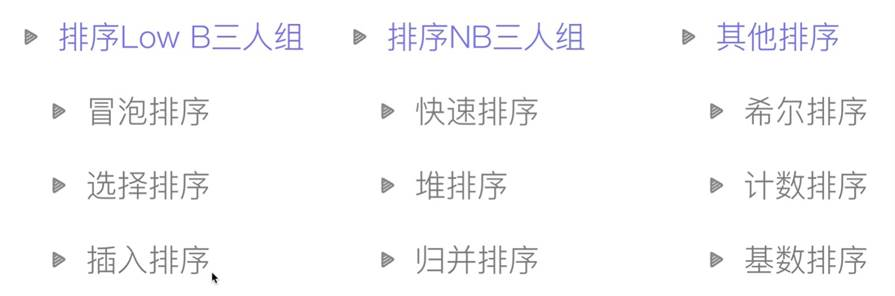

## 冒泡排序
### 冒泡排序的基础知识

冒泡排序的思想（理解）
>（冒泡排序排列从小到大的时候）
>对列表进行冒泡排序，在每一轮排序里，从表头开始，依次让相邻的元素进行比较，如果前一个比后一个大则交换，最终让最大的元素移至列表尾部。以此类推，通过一轮轮排序，使整个整个列表都被排序好。
>
>具体的说明，通过第一轮排序能找出最大的元素，并使最大的元素移至列表最后一位，然后通过第二轮排序使次大的元素移至列表倒数第二位，以此类推，直至所有元素有序。

冒泡排序的举例
>假设待排序序列为 (5,1,4,2,8)，采用冒泡排序对其进行升序（由小到大）排序
>
>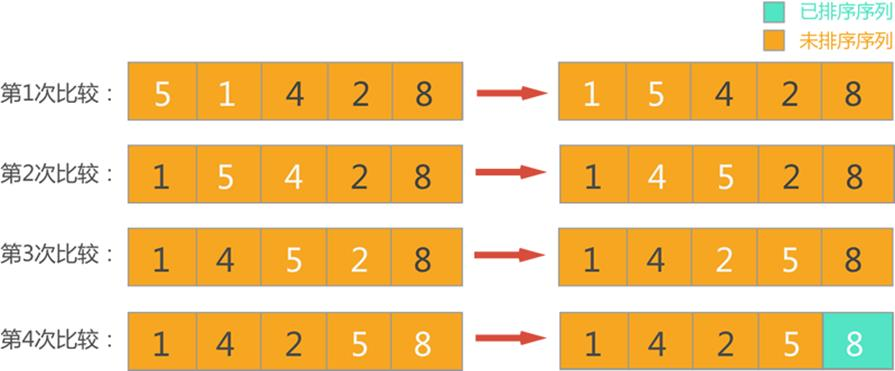第一轮排序，此时整个序列中的元素都位于待排序序列，依次扫描每对相邻的元素，并对顺序不正确的元素对交换位置，整个过程如图所示。
>第一轮冒泡排序，从待排序序列中找出了最大数 8，并将其放到了待排序序列的尾部并入已排序序列中。
>
>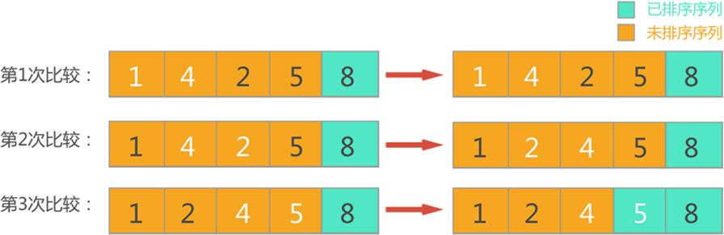第二轮排序，此时待排序序列只包含前 4 个元素，依次扫描每对相邻元素，对顺序不正确的元素对交换位置。
>经过第二轮冒泡排序，从待排序序列中找出了最大数 5，并将其放到了待排序序列的尾部，并入已排序序列中。
>
>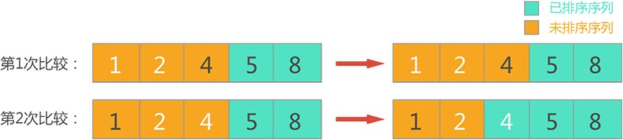 第三轮排序，此时待排序序列包含前 3 个元素，依次扫描每对相邻元素，对顺序不正确的元素对交换位置。
>经过本轮冒泡排序，从待排序序列中找出了最大数 4，并将其放到了待排序序列的尾部，并入已排序序列中。
>
>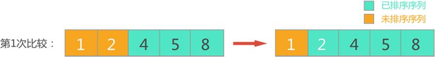第四轮排序，此时待排序序列包含前 2 个元素，经过本轮冒泡排序，从待排序序列中找出了最大数 2，并将其放到了待排序序列的尾部，并入已排序序列中。
>
>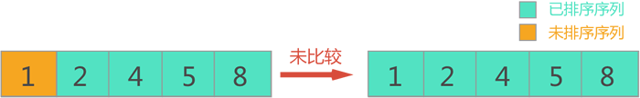进行第五轮冒泡排序时，由于待排序序列中仅剩 1 个元素，无论再进行相邻元素的比较，因此直接将其并入已排序序列中，此时的序列就认定为已排序好的序列。
>一共5个数，举行5-1轮排序。


### 冒泡排序的实现
冒泡排序的实现代码
```
#include <bits/stdc++.h>
using namespace std;

//冒泡排序函数
void mppx(int a[], int n)
{

    //第一层循环，每经历第一层循环，就找最大的一个数字放在最右边.列表里有n个数，则一共要经历n-1轮
    for (int i = 1; i <= n - 1; i++)
    {
        //第二层循环，每经历一次循环，就表示有一对相邻的数进行比较交换。
        //n-i表示当前可以交换的数的最大下标，n-i-1表示可以交换的最大数的前一个数的下标
        for (int j = 0; j <= n - i - 1; j++)
        {
            if (a[j] < a[j + 1])
            {
                int temp = a[j + 1];
                a[j + 1] = a[j];
                a[j] = temp;
            }
        }
    }
}

//主函数，测试函数
int main()
{
    int a[10001];
    int n;
    cin >> n;
	//输入要排序的数组序列
    for (int i = 0; i < n; i++)
    {
        cin >> a[i];
    }
}
```


冒泡排序的时间复杂度
>冒泡排序一共要进行(n-1)轮排序，第一轮排序(n-1),第二轮排序(n-2),直到最后一轮排序1次。
>所以一共的比较次数是:
>(n-1) + (n-2) + (n-3) + … + 1 = n*(n-1)/2;
>所以冒泡排序的时间复杂度是 O(n平方)

冒泡排序的空间复杂度
>`O(1)`


## 选择排序
### 选择排序的基础知识
选择排序的思想（理解）
>对列表进行选择排序，在每一轮排序里，选择未排序列的最小的元素，放到已排序序列的末尾。以此类推，通过一轮轮排序，使整个整个列表都被排序好。
>
>具体的说明，第一轮排序里，在待排序记录r[1]~r[n]中选出最小的记录，将它与r[1]交换，此时r[1]是已排序序列， 待排序记录为r[2]~r[n]  ；第二轮排序里，在待排序记录r[2]~r[n]中选出最小的记录，将它与r[2]交换，此时r[1]r[2]是已排序序列；以此类推，直到全部排序完成


选择排序的举例说明
>初始序列：{2 4 7 1 6 9 8 3 0 5} 　　
>第1趟：2与0交换：0{4 7 1 6 9 8 3 2 5} 　　
>第2趟：0不动,4与1交换：0 1{7 4 6 9 8 3 2 5} 　　
>第3趟：7与2交换：0 1 2{4 6 9 8 3 7 5} 　　
>第4趟：4与3交换：0 1 2 3{6 9 8 4 7 5} 　　
>第5趟：6与4交换：0 1 2 3 4{9 8 6 7 5}
>第6趟：9与5交换：0 1 2 3 4 5{8 6 7 9}
>第7趟：8与6交换：0 1 2 3 4 5 6{8 7 9}
>第8趟：8与7交换：0 1 2 3 4 5 6 7{8 9}
>第9趟：排序完成

### 选择排序的实现
选择排序的代码
```
#include <bits/stdc++.h>
using namespace std;

//选择排序函数
// a是传入的数组序列，n是数组里的存储的数量
void xzpx(int a[], int n)
{

    //第一层循环，每经历第一层循环，就找最小的一个数字放在最左边，列表n个数只需要n-1轮循环即可
    for (int i = 1; i <= n - 1; i++)
    {
        //存储找到的未排序列最小的值，暂存未排序列的第一个元素
        int temp = a[i - 1];
        //存储找到未排序列最小的值的下标，暂存第一个元素的下标

        int jl = i - 1;

        //第二层循环，每经历一次循环，就有一次对比，未排序列表有10个数就要对比9次。通过这次循环找到现有未排序列最小值存储到temp，下标存储到jl；

        for (int j = i; j <= n - 1; j++)

        {

            if (temp > a[j])

            {

                temp = a[j];

                jl = j;

            }

        }

        //将找到的最小的值，与未排序列的第一个值的位置交换，这时该位置就是属于已排序列

        a[jl] = a[i - 1];

        a[i - 1] = temp;

    }

}
//主函数，测试函数
int main()

{

    int a[10001];
    int n;
    cin >> n;
    //输入要排序的数组序列
    for (int i = 0; i < n; i++)
    {
        cin >> a[i];
    }

    //对数组序列进行从大到小的选择排序_

    xzpx(a, n);
    //对排序后的数组进行输出_

    for (int i = 0; i < n; i++)
    {
        cout << a[i] << " ";
    }

}
```


选择排序的时间复杂度
>
>待排序列表r,列表长度为n, 每次循环从待排序列表中，找到最小的值。所以一共经历(n-1次循环)
>第一次循环，r[0]得和(n-1)个数进行对比，r[2]得和（n-2）个数进行对比，直到最后一次循环，r[n-2]，只和最后一个数进行对比，则时间复杂度为(n-1) + (n-2) + (n-3) + … + 1 = n*(n-1)/2;
>所以`O(n^2)`

选择排序空间复杂度
>`O(1)`

## 插入排序
### 插入排序的基础知识
插入排序的思想（理解）
>对列表进行插入排序，在每一轮排序里，将一个待排序列的元素，按其值大小插入到已排序列里的适当位置上去。以此类推，通过一轮轮排序，使整个整个列表都被排序好。
>
>具体说明：
>首先默认列表第一个元素是已排序列，然后在第一轮排序里，将待排序列里的一个数，一般是第一个数，在已排序序列中从后向前扫描对比（也就是大到小扫描对比），找到相应位置并插入。
>之后的每一轮排序里都将一个待排序的元素，在已排序序列中从后向前扫描对比，按其值大小插入到前面已排序里的适当位置上去，直到全部排序完成

插入排序的举例说明
>对一组序列（9，3，1，4，2，7，8，6，5）用插入排序从小到大进行排序
>
>首先
>先把待排序序列第一个元素9，直接当做已排序序列，放在已排序序列。
>此时已排序序列为（9），待排序序列为（3，1，4，2，7，8，6，5）
>然后如下图进行排序。
>
>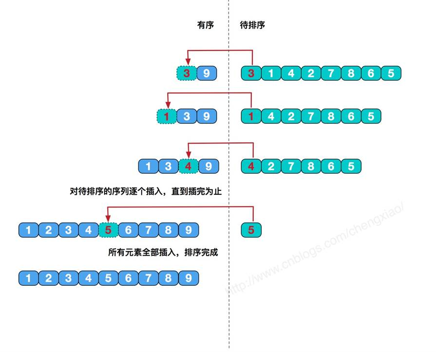每步将一个待排序的元素，按其值大小插入到前面已经排好序的一组元素的适当位置上去，直到元素全部插入为止
>
>在正式代码里，为了减少内存的使用，就不会建立两个表来区分待排序列表和未排序列表，待排序列表和未排序列表都会统一放在同一个列表内来进行插入排序。


### 插入排序的实现
插入排序的实现代码
```
#include<bits/stdc++.h>
using namespace std;

//插入排序函数 
void crpx(int a[],int n)
{
	//第一层循环，每次循环就将一个待排序的一个值插入到已排序的序列里，一共进行(n-1)轮排序。i是待排序的下标
	for(int i=1;i<=n-1;i++)
	{
		//待排序元素
		int temp=a[i];

		//第二层循环，每次循环最开始，j是已排的序列的最大值的下标
		int j=i-1;
		for(;j>=0;)
		{	
			if(temp<a[j])
			{	
				a[j+1]=a[j];j--;
				
				
			} 
			else if(temp>=a[j])
			{
				break;	
			}
			
		}
		a[j+1]=temp;

		
	}
}
//主函数，测试函数
int main()
{
	int a[10001]; 
	int n;
	cin>>n;
	
	//输入要排序的数组序列 
	for(int i=0;i<n;i++)
	{
		cin>>a[i];
	} 
	
	//对数组序列进行从大到小的插入排序 
	crpx(a,n);
	
	//对排序后的数组进行输出 
	for(int i=0;i<n;i++){
	cout<<a[i]<<" "; 
	}
}
/* 
代码说明
输入5
3 7 1 8 5
排序过程
以上面的例子来说排序的对象是 3，7，1，8，5 数组长度为5，因为第一个元素看做一个有序序列  ，所以for循环的次数是：5（数组长度） - 1 = 4, 每次循环就将一个待排序的一个值插入到已排序的序列里，
第一轮for循环
列表：3 7 1 8 5
3>7不成立，插入待排序元素，列表为3 7 1 8 5，此时有序序列为3，7

第二轮for循环
列表：3 7 1 8 5
7>1成立，数组变成3，7，7，8，5
3>1成立，数组变成3，3，7，8，5
插入待排序元素，此时列表为1，3，7，8，5，有序序列为1，3，7

第三次for循环
列表：1，3，7，8，5，
7>8不成立，插入待排序元素，列表为1，3，7，8，5此时有序序列为1，3，7，8
 
第四次for循环
列表：1，3，7，8，5
8>5成立，数组变成1，3，7，8，8
7>5成立，数组变成1，3，7，7，8
3>5不成立，插入待排序元素，此时数组为1，3，5，7，8，有序序列为1，3，5，7，8，排序完成
*/
```


时间复杂度
>一共经历(n-1)次轮循环。第一轮循环最多对比一次，第2轮循环最多对比2次，第(n-1)循环最多对比n-1次
>(n-1) + (n-2) + (n-3) + … + 1 = n*(n-1)/2;
>O(n^2)

空间复杂度
>`O(1)`

## 快速排序

### 归位操作

归位操作的具体实现过程
>
>设置两个指针 low 和 high，分别指向无序表的表头和表尾。先由 high 指针从右往左依次遍历，直到找到一个比 49 小的关键字，所以 high 指针走到 27 的地方停止。找到之后将该关键字同 low 指向的关键字进行互换
>
>
>然后指针 low 从左往右依次遍历，直到找到一个比 49 大的关键字为止，所以 low 指针走到 65 的地方停止。同样找到后同 high 指向的关键字进行互换：
>
>
>指针 high 继续左移，到 13 所在的位置停止（13<49），然后同 low 指向的关键字进行互换
>
>
>指针 low 继续右移，到 97 所在的位置停止（97>49），然后同 high 指向的关键字互换位置
>
>
>指针 high 继续左移，此时两指针相遇，整个过程结束；

归位函数的实现代码
```
//归位操作的函数，L是列表，left和right分别是表左和表右的下标
int Partition(int *L,int left,int right) 
{
	int temp= L[left];
	while(left<right)
	{
		while(L[right]>=temp&&left<right)//这个循环找右边比temp小的数 
		{
			right=right-1; 
		}
		
		//找到后右边的值换到左边来，左边的值换到右边来 
		L[left]=L[right];// 

		
		while(L[left]<=temp&&left<right)//这个循环找右边比temp大的数 
		{
			left=left+1;
		} 
		//找到后右边的值换到左边来，左边的值换到右边来 
		L[right]=L[left];
		
	}
	L[left]=temp; 
	return left;
}
```

归位


### 快速排序的基础知识
快速排序的理解
>对一个列表进行快速排序，首先就是先对列表进行归位操作 ，一般是取列表的第一个元素p进行归位，这时列表被p分成两部分，左边列表的值都比p小，右边列表的值都比p大，然后让左边列表进行归位操作，让右边列表也进行归位操作。以此类推，最终所有元素都依次被归位好。
>注意
>一般快排的实现是用递归方式。


快速排序的举例说明
>例如，对无序表`{49，38，65，97，76，13，27，49}`进行快速排序，大致过程为：
>1.  首先从表中选取一个元素，一般是第一个元素，例如选取 49；
>2.  然后对49进行归位操作，既将表格中大于 49 个放置于 49 的右侧，小于 49 的放置于 49 的左侧，假设完成后的无序表为：`{27，38，13，49，65，97，76，49}`；
>3.  以 49 为支点，将整个无序表分割成了两个部分，分别为无序表1`{27，38，13}`和无序表2`{65，97，76，49}`，继续采用此种方法分别对两个无序表进行排序；
>4.  无序表1选取第一个元素27进行归位 ，排序后为`{13，27，38}`，此部分已经有序；无序表2表选取第一个元素 65 进行归位，排序后为`{49，65，97，76}`；
>5.  `然后无序表3{97，76}`，选取第一个元素97，排序后的结果为`{76，97}`；
>6.  通过以上几步的排序，构成有序表：`{13，27，38，49，49，65，76，97}`；

归为操作的时间复杂度
>n个数，归为一次就得遍历n-1个数，因此归位操作的时间复杂度为`O(n)`

### 快速排序的实现
快速排序的实现代码
```
//归位操作的函数，L是列表，left和right分别是表左和表右的下标，返回值是归位后的元素的下标。
 int Partition(int *L,int left,int right)
	int temp= L[left];
	while(left<right)
	{
		//这个循环找右边比temp小的数 
		while(L[right]>=temp&&left<right)
		{
			right=right-1; 
		}
		
		//找到后右边的值换到左边来，左边的值换到右边来 
		L[left]=L[right];// 

		//这个循环找右边比temp大的数 
		while(L[left]<=temp&&left<right)
		{
			left=left+1;
		} 
		//找到后右边的值换到左边来，左边的值换到右边来 
		L[right]=L[left];
		
	}
	L[left]=temp; 
	return left;
}
  
void QSort(int *L,int left,int right)//快速排序函数 
{
    if (left<right) 
	{
       //对第一个元素进行归位操作，然后返回的归位后的下标传给变量mid，既mid记录归位后的下标
        int mid=Partition(L, left, right);
        //对支点左侧的子表进行排序
        QSort(L, left, mid-1);
        //对支点右侧的子表进行排序
        QSort(L, mid+1, right);
    }
}

int main()
{
	int L[10]={5,7,4,6,3,1,2,9,8};
	QSort(L,0,8);
	for(int i=0;i<9;i++)
	{
		cout<<L[i]<<",";
	}
} 

```


最好情况时间复杂度和空间复杂度
>
>一般情况下每次对列表进行归位，列表会以归位的数字为中心轴，把列表分为左右两个子表，左边的表数小于右边的数。
>这里假设，列表有n=16个数，且每次列表进行归位操作后，列表被平等的分为左右两个子表，当列表N个数时候，归位一次的需要循环n-1次，也就是时间复杂度为O（n）如上图16个数可分为log2(底数)16(真数)= log2(底数)n(真数)=4层。每一层所有的列表进行归位操作总共需要循环n次。 所以时间复杂度为`O(nlogn)`
>这里快速排序是递归调用，递归一层就消耗1空间。由上图可知，递归调用了logn层，所以空间复杂度就为O（logn）

最坏情况的时间复杂度
>未排序列表为 9 8 7 6 5 4 3 2 1
>首先对该列表第一个元素进行归位操作得到 1 8 7 6 5 4 3 2 9。
>
>然后递归函数调用，要对列表1 8 7 6 5 4 3 2 进行归位操作，得到8 7 6 5 4 3 2，
>然后函数递归对列表 8 7 6 5 4 3 2 进行归位。依次下去。
>可以理解为N个数，每次归位操作，才能把一个数字回归到正确位置。N个数，就得N次归位。第一次归位需要遍历n-1次，第二次(n-2) ,
>所以最坏情况下时间复杂度为.
（n-1）+（n-2）+.....+2，也就是`O(n^2)`
>每次归位操作，才能把一个数字回归到正确位置。N个数，就得N次归位，也就是得n次递归调用归位函数，递归函数的深度为n所以空间复杂度为`O(n)`.

## 堆排序

### 堆的向下调整

堆的向下调整的理解
>假设有一个二叉树，根的左右子树都是堆，但是自身不是堆。此时可以通过一次向下调整，使根节点找到合适的位置，然后使这个二叉树变成堆

过程
>
>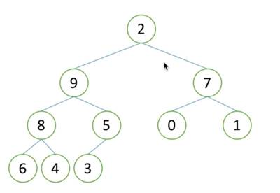假设该二叉树如图
>
>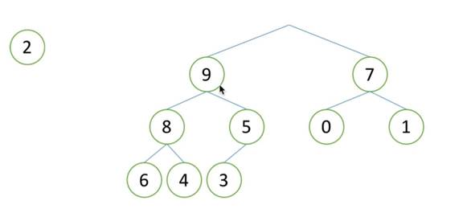首先把根节点取出来。此时判定2的左右节点，比较大的节点（左节点），来做根节点的位置
>
>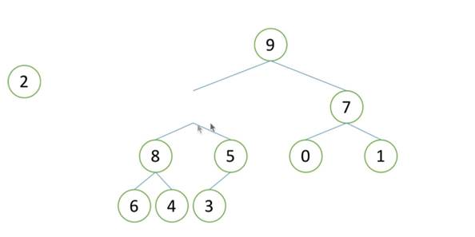然后判定2能不能做空的节点的位置，不能则在从该空节点的左右节点找较大的一个节点（左结点8）
>顶上去到空的节点位置
>
>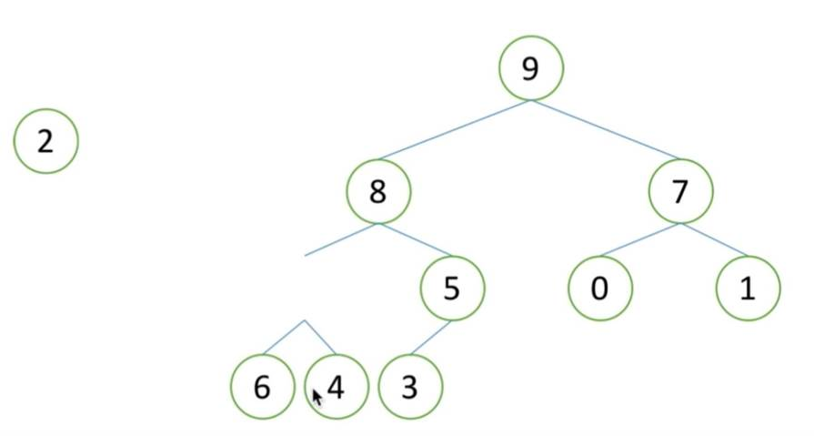然后同上面一样依次判定，2能不能做空节点的位置，不能，再判定空节点的左右节点大小。
>
>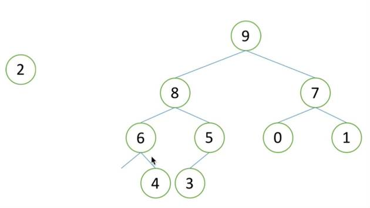大的一位来做空节点的位置。
>
>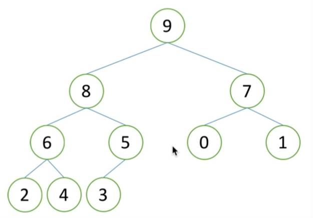
>然后判定2能不能做空节点的位置，可以则调整完成。

堆的向下调整代码实现
```
//sift函数，即堆的向下调整函数。li为存储二叉树的列表，low二叉树根节点的下标，high二叉树最后一个节点的下标
void sift(int *li,int low,int high)
{	//i指向最开始的根节点的存储位置 
	int i=low;
	//j是i的左孩子下标。
	int j=2*i+1;
	//temp存储根节点的值。 
	int temp=li[low];
	
	
	while(1)	 
	{
		//j位置有数，则循环继续。
		if(j<=high)
		{
		
			//如果右孩子节点存在，且比左孩子节点大，j更改为右孩子的下标。 
			if(j+1<=high&&li[j]<li[j+1]) ++j; 
			
			if(li[j]>temp)
			{
				li[i]=li[j];
				i=j;
				j=2*i+1;
			} 
			else
			{
				li[i]=temp;break;
			}
		}
		//j位置无效，则把temp放在叶子节点上 
		else
		{
			li[i]=temp;break;
		}
	
			
	} 
}

```

堆的向下调整时间复杂度
>因为每执行一次循环，数据就少一半，则堆的向下调整函数最差的时间复杂度为 O(logn)


### 堆的构造

堆的理解
>一种特殊的完全二叉树结构。主要分为大根堆和小根堆

大根堆的理解
>大根堆一颗完全二叉树，且满足任一节点都比孩子节点大
大根堆结构图
>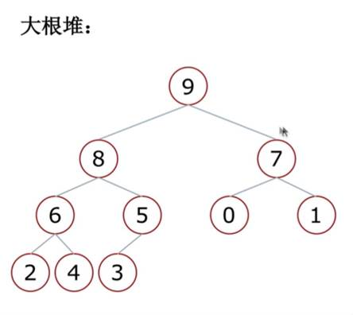

小根堆的理解
>小根堆是一颗完全二叉树，且满足任一节点比孩子节点小
>
>小根堆结构图
>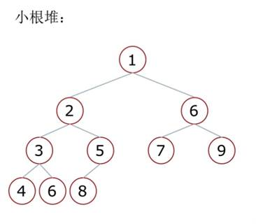


堆的构造举例说明
>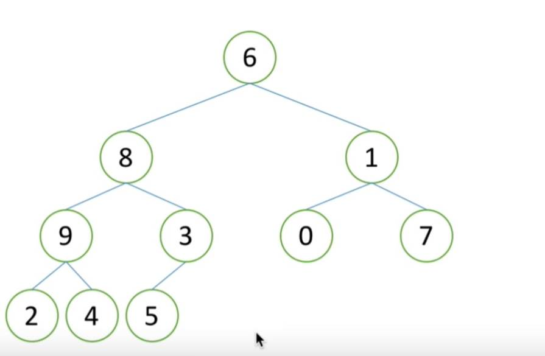首先为了方便说明。这里默认对二叉树结点按从上至下、从左到右的顺序编号。依这个编号，我们说该二叉树的最后一个非叶子节点就是3，然后倒数第二个非叶子节点9，倒数第三个非叶子节点就是1，以此类推说明。
>
>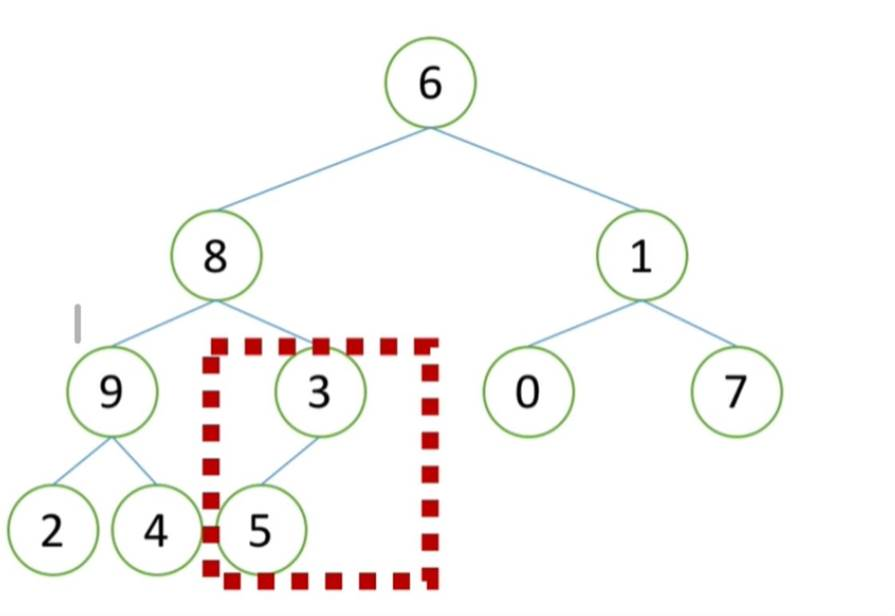首先找到最后一个非叶子节点。
>
>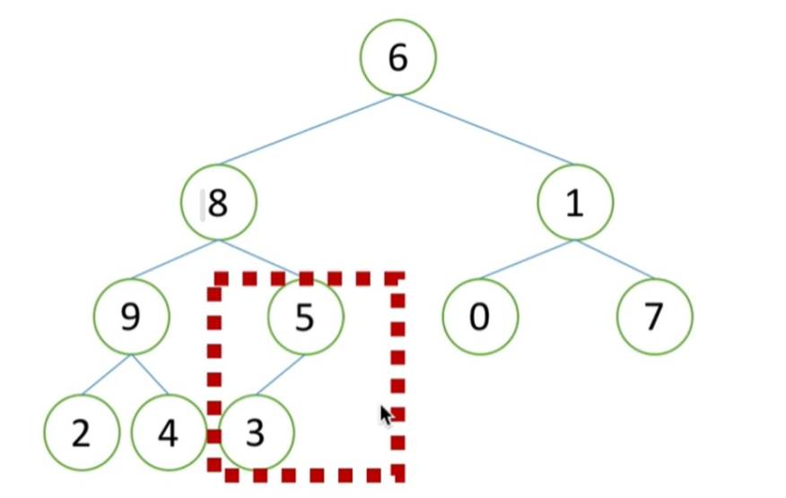然后对这个非叶子节点和他的左右子二叉树构成的二叉树做一次根的向下调整。
>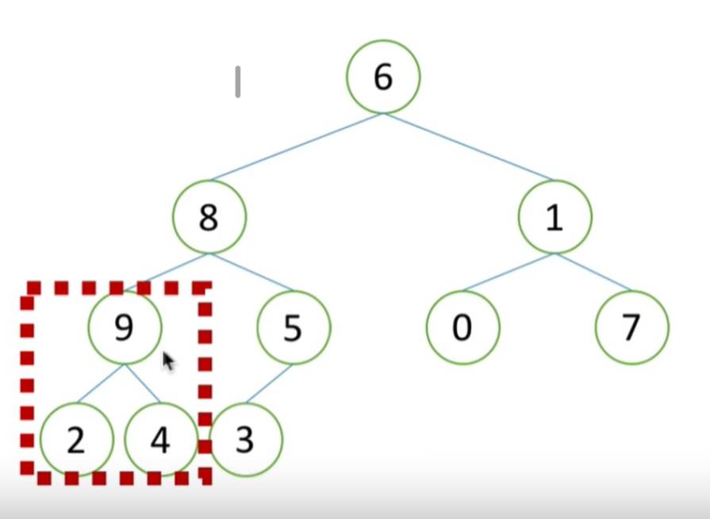然后找到倒数第二个非叶子节点。因为该子节点已经符合大大根堆的性质，不用调整。
>
>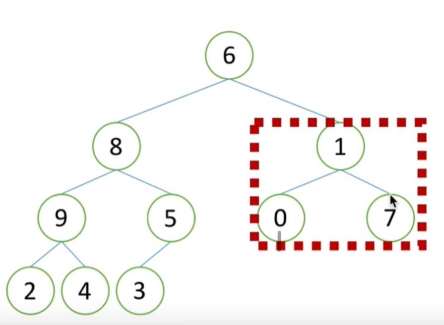然后找到倒数第三个的非叶子节点
以该节点为根节点构成的二叉树，然后进行一次根的向下调整。
>
>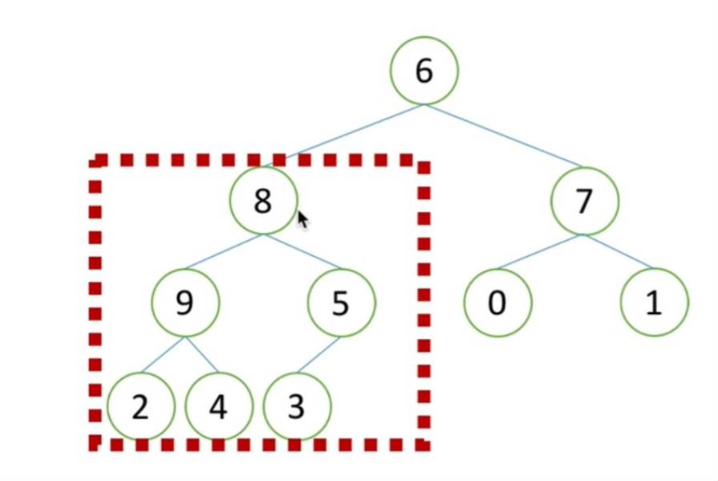找到倒数第四个节点
以该节点构成的二叉树，进行一次根的向下调整。
>
>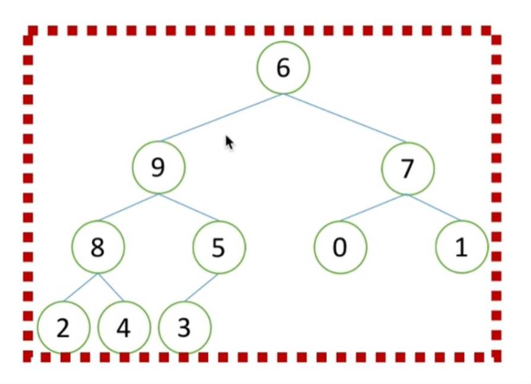然后就到根节点，对根节点构成的二叉树 进行一次根的向下调整。
>
>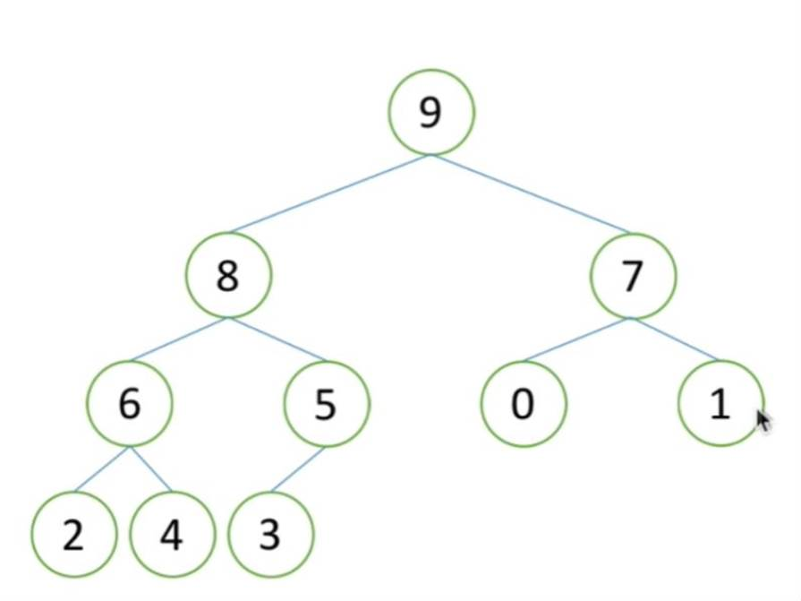
>最终就构成了堆

堆的构造代码实现
```
//sift函数，即堆的向下调整函数。li为存储二叉树的列表，low二叉树根节点的下标，high二叉树最后一个节点的下标 
void sift(int *li,int low,int high)
{	//i指向最开始的根节点的存储位置 
	int i=low;
	//j是i的左孩子下标。
	int j=2*i+1;
	//temp存储根节点的值。 
	int temp=li[low];
	
	
	while(1)	 
	{
		//j位置存在，则循环继续。
		if(j<=high)
		{
		
			//如果右孩子节点存在，且比左孩子节点大，j更改为右孩子的下标。 
			if(j+1<=high&&li[j]<li[j+1]) ++j; 
			if(li[j]>temp)
			{
				li[i]=li[j];
				i=j;
				j=2*i+1;
			} 
			else
			{
				li[i]=temp;break;
			}
		}
		//j位置不存在，则把temp放在叶子节点上 
		else
		{
			li[i]=temp;break;
		}
	
			
	} 
}
//构造大根堆的函数,li为列表，n为列表长度 
void dgz(int *li,int n)
{ 
	//j是最后一个非叶子节点。也就是说为下标为n-1的节点的父节点，也就是最后一个节点的父节点。
	int j=(n-2)/2; 
	
	//这里的i为要调整的二叉树的根节点。 
	for(int i=j;i>=0;i--)
	{
		//这里每次循环执行一次sift,就是将要调整的二叉树调整为堆。 
		//这里拿n-1也就是最后一个节点的下标，作为high，而不是拿要调整的二叉树的最后一个节点的下标作为high。是因为high的作用的本质是在sift函数里的判断j位置是否存在。那么这里可以直接用最后一个节点下标 n-1，依旧可以实现这个作用。就不需要每次循环重新计算要调整的二叉树的最后一个节点的下标。 
		sift(li,i,n-1);
		 
	}
} 
```

### 堆排序的基础知识
堆排序的理解
>对列表进行堆排序，首先将待排序列构建成大根堆，然后将堆顶元素与堆尾元素交换，此时列表尾部就是已排序列。之后在每一轮排序里，对待排列执行以此堆的向下调整，然后将堆顶元素与堆尾元素交换，以此类推，最终整个序列有序。
>
>具体的说明
>1.建立大根堆。
>2.得到堆顶元素，为当前堆的最大元素，放到一个新列表里。
>3.去掉堆顶，将堆最后一个元素放到堆顶，此时可通过一次堆的向下调整重新使堆有序。
>（将最后一个元素放到堆顶，而不是把原本的根节点的左右节点放到跟堆顶。是为了维持完全二叉树）
>4.此时堆顶元素为当前堆的最大元素，放到之前的新列表。
>5.重复步骤3，直到堆变空。原本堆的所有元素都在新列表里排序好了。

堆排序的举例说明
>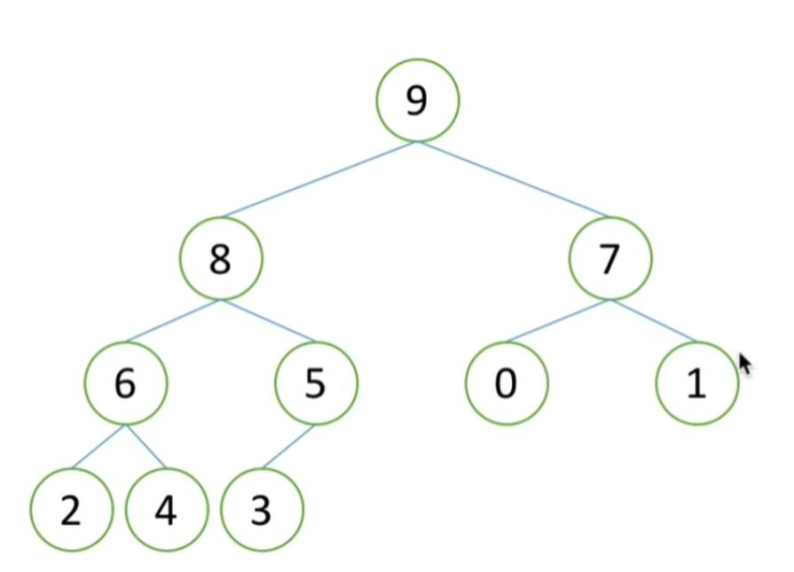最开始建立堆
>
>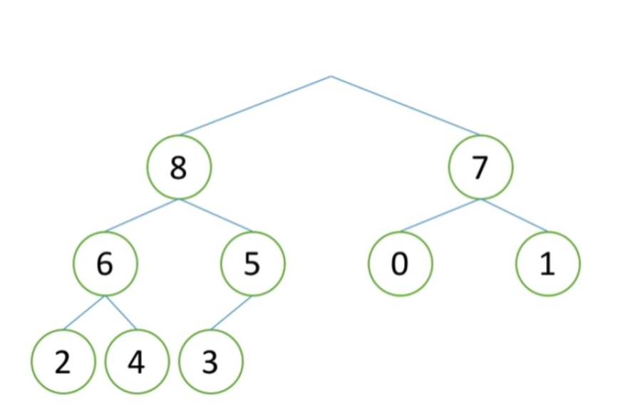取出堆顶（此时堆顶是最大元素），放入一个列表里。
>
>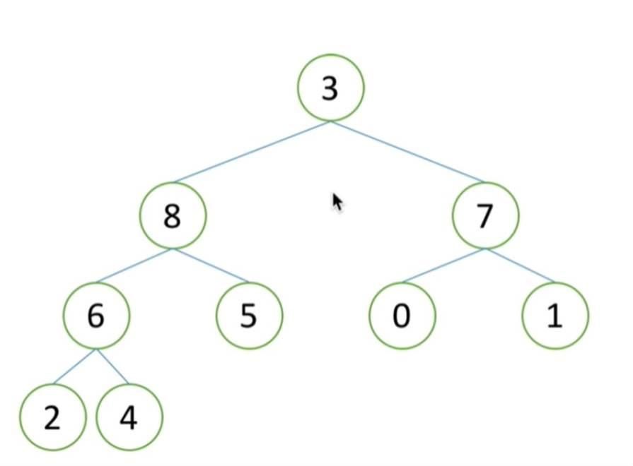把堆的最后一个元素放到堆顶。
>
>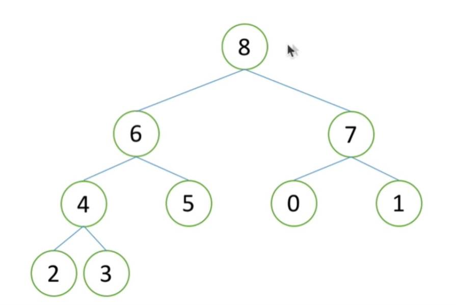此时做一次堆的向下调整
>然后此时堆顶元素又是最大的元素。
>
>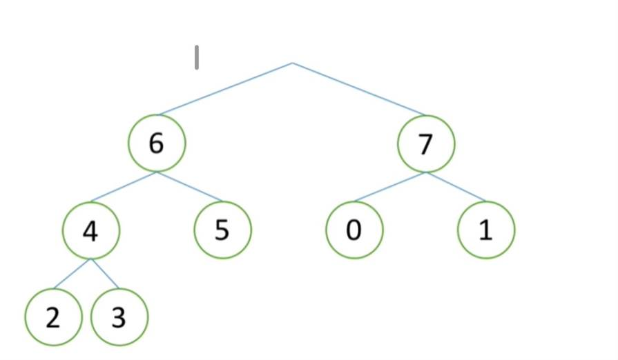把堆顶元素取出来在放入列表里
>
>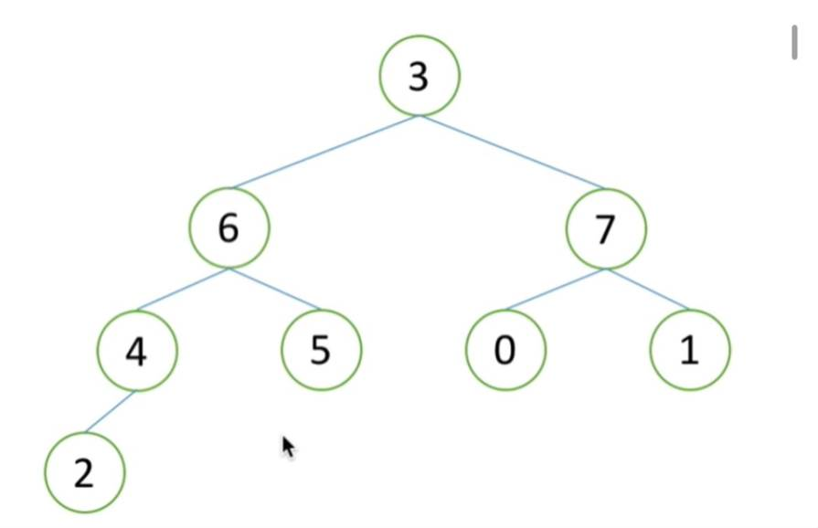
>再把最后一个元素放到堆顶。
>然后再进行堆的一次向下调整。依次循环这些步骤，直到元素全部取出来放入列表里，从大到小排序好。
>
>注意
>这里我们的演示为了方便理解，我们会在外面开辟一个列表。然后每次堆进行向下调整后，我们就把堆顶元素（当前堆最大的元素）取出来，放到这个列表，然后把堆的最后一个元素放到堆顶，然后再进行堆的向下调整，然后再取出堆顶，再然后放到列表，依次循环，直至列表填满，然后此时列表里也是从小到大的排序好。
>
>但是实际中写代码中，为了减少资源的浪费，我们是不会再开辟一个列表。那么我们每次取出堆顶元素就依然会放到存储该二叉树的列表里。最开始，取堆顶元素，然后让堆顶元素和堆的最后一个元素进行交换。此堆的最后一个节点的位置（堆顶所在的位置）不属于这个堆，然后再标记该节点的上一个节点，即倒数第二个节点为堆的最后一个元素位置。 然后进行一次堆的向下调整，然后此时的堆顶是当前堆的最大元素，然后继续让堆顶和当前堆的最后一个元素进行交换，此时的堆顶就在倒数第二个节点的位置，此时该节点的位置就不属于这个堆 ，并且标记倒数第三个节点的位置为堆的最后一个元素位置  。以此类推，这样就可以减少资源  的浪费，不用在开辟一个列表。


### 堆排序的实现
堆排序的实现代码
```
#include<bits/stdc++.h>
using namespace std;

//sift函数，即堆的向下调整函数。li为存储二叉树的列表，low二叉树根节点的下标，high二叉树最后一个节点的下标 
void sift(int *li,int low,int high)
{	//i指向最开始的根节点的存储位置 
	int i=low;
	//j是i的左孩子下标。
	int j=2*i+1;
	//temp存储根节点的值。 
	int temp=li[low];
	
	
	while(1)	 
	{
		//j位置有数，则循环继续。
		if(j<=high)
		{
		
			//如果右孩子节点存在，且比左孩子节点大，j更改为右孩子的下标。 
			if(j+1<=high&&li[j]<li[j+1]) ++j; 
			if(li[j]>temp)
			{
				li[i]=li[j];
				i=j;
				j=2*i+1;
			} 
			else
			{
				li[i]=temp;break;
			}
		}
		//j位置无数，则把temp放在叶子节点上 
		else
		{
			li[i]=temp;break;
		}
	
			
	} 
}
//堆构造函数,li为列表，n为列表长度 
void dgz(int *li,int n)
{ 
	//j为下标为n-1的节点的父节点，也就是最后一个节点的父节点。j也是最后一个非叶子节点 
	int j=(n-2)/2; 
	
	//这里的i为要调整的二叉树的根节点。 
	for(int i=j;i>=0;i--)
	{
		//这里每次循环执行一次sift,就是将要调整的二叉树调整为堆。 
		//这里拿n-1也就是最后一个节点的下标，作为high，而不是拿要调整的二叉树的最后一个节点的下标作为high。是因为high的作用的本质是在sift函数里的判断j位置是否存在。那么这里可以直接用最后一个节点下标 n-1，依旧可以实现这个作用。就不需要每次循环重新计算要调整的二叉树的最后一个节点的下标。 
		sift(li,i,n-1);
		 
	}
} 

//堆排序函数，li为堆，n为堆长度 
void heap_sort(int *li,int n)
{
	 
	//将列表构造成堆
	dgz(li,n); 
	//j为堆最后一个节点的下标。
	for(int j=n-1;j>0;){
		int temp=li[0];
		li[0]=li[j];
		li[j]=temp;
		
		//这里j指向堆的最后一个节点的下标 
		--j;
		sift(li,0,j);
	}
}
int main()
{
	int a[11]={5,2,1,6,7,8,9,4,3,10,0};
	heap_sort(a,11); 
	for(int i=0;i<=10;i++)
	{
		cout<<a[i]<<endl;
	}
	
} 
```


时间复杂度
```
void sift(int *li,int low,int high)
{	//指向最开始的根节点的存储位置 
	int i=low;
	//j是i的左孩子下标。
	int j=2*i+1;
	//temp存储根节点的值。 
	int temp=li[low];
	
	
	while(1)	 
	{
		//j位置有数，则循环继续。
		if(j<=high)
		{
		
			//如果右孩子节点存在，且比左孩子节点大，j更改为右孩子的下标。 
			if(j+1<=high&&li[j]<li[j+1]) ++j; 
			if(li[j]>temp)
			{
				li[i]=li[j];
				i=j;
				j=2*i+1;
			} 
			else
			{
				li[i]=temp;break;
			}
		}
		//j位置无数，则把temp放在叶子节点上 
		else
		{
			li[i]=temp;break;
		}
	
			
	} 
}


因为每执行一次循环，数据就少一半，则堆的向下调整函数最差的时间复杂度为 O(logn)

//堆构造函数,li为列表，n为列表长度 
void dgz(int *li,int n)
{ 
	//j为下标为n-1的节点的父节点，也就是最后一个节点的父节点。j也是最后一个非叶子节点 
	int j=(n-2)/2; 
	
	//这里的i为要调整的二叉树的根节点。 
	for(int i=j;i>=0;i--)
	{
		//这里每次循环执行一次sift,就是将要调整的二叉树调整为堆。 
		//这里拿n-1也就是最后一个节点的下标，作为high，而不是拿要调整的二叉树的最后一个节点的下标作为high。是因为high的作用的本质是在sift函数里的判断j位置是否存在。那么这里可以直接用最后一个节点下标 n-1，依旧可以实现这个作用。就不需要每次循环重新计算要调整的二叉树的最后一个节点的下标。 
		sift(li,i,n-1);
			 
	}
} 
时间复杂度，循环的次数为(n-2)/2次数，每次都要执行sift函数，所以时间复杂度为O(nlogn)

//堆排序函数，li为堆，n为堆长度 
void heap_sort(int *li,int n)
{
	//j为堆最后一个节点的下标。 

	dgz(li,n); 
	for(int j=n-1;j>0;){
		int temp=li[0];
		li[0]=li[j];
		li[j]=temp;
		
		//这里j指向堆的最后一个节点的下标 
		--j;
		sift(li,0,j);
	}
}
执行n-2次循环,每次循环执行sift函数
堆排序的时间复杂度为O(nlogn)
```


## 归并排序

### 归并操作
归并操作的理解
>假设有一段列表，它可分成两段各自有序列表，但是列表本身不是有序。而将两个各自有序的列表合成一个有序列表该操作就叫归并

归并操作的举例说明
>
>举例有一列表如图，分为两段，左右两段各自有序。
>此时新建一个新的空列表。然后对比两段列表的第一个元素，将里面小的放到新的列表里。此时左列表的第一个元素2，右列表的第一个元素1，1小于2.则将1放到新的列表里。
>
> 	
>然后再将右列表的下标往右边移，此时3就为右列表的第一个元素。再让左列表的第一个元素2和右列表的第一个元素3做对比。
>
>
> 
>2小于3，2放到新的列表，并且将左列表下标往右边移，此时左列表的第一个元素就是5.
>然后重复上面的操作，依次将两个列表的第一个元素，对比，小的进入新的列表里。
>
>
直到某一个列表所有的数都进入到新的列表里，剩下的另一个列表也就不用继续对比，而是直接进入新列表。如图右列表已经全部进入新的列表里，还剩下左列表。这时候左列表直接全部进入新列表即可。
>
>
>
这时候两段各自有序的列表，就合并为一个有序的列表。

归并操作的代码实现
```
#include<bits/stdc++.h>
using namespace std;
//归并操作,li为传入的列表，列表里可以分成左右两段各自为序的列表
//low为左列表的第一个数的下标。mid为左列表最后一个数的下标，此时右列表第一个数的下标就为mid+1，high为右列表最后一个数的下标 
void merge(int *li,int low,int mid,int high )
{
	//构建的新列表，用来存储左右列表对比的数。 
	vector<int> a;
	//i为左列表第一个数下标，j为右列表第一个数下标 
	int i=low;
	int j=mid+1;
	
	//当左右两边列表有数的时候，循环继续。 
	while(i<=mid&&j<=high)
	{
		//左列表第一个数小于右列表第一个数，则左列表第一个数存入新列表，并且往左列表下的标往右边移动 
		if(li[i]<li[j])
		{
			a.push_back(li[i]);i++;
		}
		//右列表列表第一个数小于左列表第一个数，则右列表第一个数存入新列表，并且往右列表的下标往右边移动 
		else
		{
			a.push_back(li[j]);j++;
		}
	} 
	//右列表已经没有，左列表还有值，则将左列表剩下的值都存入新列表。 
	while(i<=mid)
	{
		a.push_back(li[i]);i++;
	}
	//左列表已经没有，右列表还有值，则将右列表剩下的值都存入新列表。 
	while(j<=high)
	{
		a.push_back(li[j]);j++;
	}
	
	//将新列表的值赋值回原来的列表。 
	int s=low;
	for(int i=0;i<a.size();++i)
	{
		li[s]=a[i];
		++s;
	} 
}
```


### 归并排序的基础知识
归并排序的理解
>将一个列表，在列表里进行分解，分解一次，列表分为两个部分，也就是两个列表。然后不断分解，直到分解到每一个列表里面都只有1个数。
>然后一个数的列表两两归并合在一起变成两个数的列表。然后已经归并好的两个数的列表，两两之间归并合在一起。以此类推，所有列表从最初分解，最终再合并成一个有序的列表。

归并排序的举例说明
>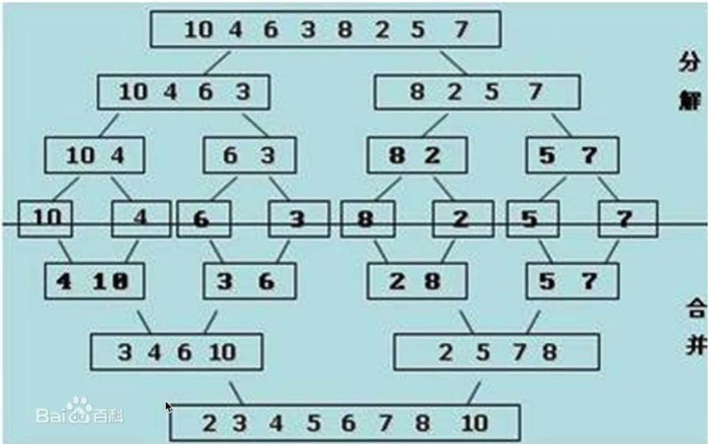


### 归并排序的实现
归并排序的实现代码
```
#include<bits/stdc++.h>
using namespace std;
//归并操作,li为传入的列表，列表里可以分成左右两段各自为序的列表
//low为左列表的第一个数的下标。mid为左列表最后一个数的下标，此时右列表第一个数的下标就为mid+1，high为右列表最后一个数的下标 
void merge(int *li,int low,int mid,int high )
{
	//构建的新列表，用来存储左右列表对比的数。 
	vector<int> a;
	//i指向左列表第一个数下标，j指向右列表第一个数下标 
	int i=low;
	int j=mid+1;
	
	//当左右两边列表有数的时候，循环继续。 
	while(i<=mid&&j<=high)
	{
		//左列表第一个数小于右列表第一个数，则左列表第一个数存入新列表，并且往左列表下的标往右边移动 
		if(li[i]<li[j])
		{
			a.push_back(li[i]);i++;
		}
		//右列表列表第一个数小于左列表第一个数，则右列表第一个数存入新列表，并且往右列表的下标往右边移动 
		else
		{
			a.push_back(li[j]);j++;
		}
	} 
	//右列表已经没有，左列表还有值，则将左列表剩下的值都存入新列表。 
	while(i<=mid)
	{
		a.push_back(li[i]);i++;
	}
	//左列表已经没有，右列表还有值，则将右列表剩下的值都存入新列表。 
	while(j<=high)
	{
		a.push_back(li[j]);j++;
	}
	
	//将新列表的值赋值回原来的列表。 
	int s=low;
	for(int i=0;i<a.size();++i)
	{
		li[s]=a[i];
		++s;
	} 
}

//merge_sort函数是归并排序函数。li为传入的无序列表。low是列表第一个数字的下标，high是最后一个数字的下标
//写merge_sort的时候，可以理解为每次执行merge_sort，其作用是传入的列表分解为两半。然后两半再继续分解。直到分解到一个列表只有1个数了。然后再进行归并操作。 
void merge_sort(int *li,int low,int high)
{
	if(low<high)
	{
		int mid=(low+high)/2;
		merge_sort(li,low,mid);
		merge_sort(li,mid+1,high);
		merge(li,low,mid,high);
	}
	
} 
int main()
{
	int a[11]={5,2,1,6,7,8,9,4,3,10,0};
	merge_sort(a,0,10);
	for(int i=0;i<=10;i++)
	{
		cout<<a[i]<<endl;
	} 
} 
```


归并排序的时间复杂度和空间复杂度
>首先是归并操作的时间复杂度
>很容易看出来，一次归并操作，需要将分解的两个列表进行遍历，也就是遍历整个列表，所以其时间复杂度是`O(n)`
>
>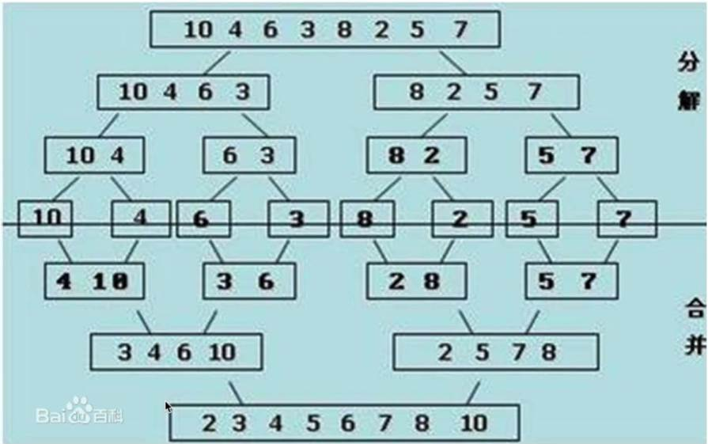由上图和实际代码可以得出，实际分解分解过程是不断递归，没有实际执行什么命令，因此实际执行命令，消耗时间在于归并操作那里。
>再上图中，有进行归并一共有三层。也就是logn层。每一层进行归并操作的时间复杂度为O（n）,所以整体的时间复杂度为O(nlogn）
>
>每次执行一次归并操作，都需要创建一个新的列表来存放归并的列表。然后归并操作结束后，新的列表被释放。
>而最后一次的归并操作，也是最大的一次归并操作，就是整个列表的归并操作的时候，这时候需要创建一个和原本列表一样大的新列表。所以空间复杂度就是O（n）。

## 希尔排序

### 希尔排序的基础知识

希尔排序的理解
>（升级版插入排序）
>希尔排序(Shell Sort)是一种分组插入排序算法。
>首先取一个整数d=n/2，将元素分为d个组，此时相邻为d的元素为一组，（相邻为d，也就是两个元素之间隔着d-1个元素的为一组），然后对每个组进行直接插入排序;
>
>取第二个整数d=d/2，重复上述分组排序过程，直到d=1，即所有元素在同一组内进行直接插入排序。
>
>希尔排序每趟并不使某些元素有序，而是使整体数据越来越接近有序;最后一趟排序使得所有数据有序。

希尔排序的举例说明
>
>以上述无序列表为例。列表长度为9，此时d=9/2=4,
>
>
>这时候可以分为四组，把两个元素之间隔着d-1=3个元素的为一组
>
>
>然后对各组进行插入排序。  如上图
>
> 
>排好之后重新计算d=d/2=2。
>
>
>这时候可以分为2组。
>
>
>然后对每组进行插入排序
>
>
>之后重新计算d=d/2=1
>
>d=1的时候，相隔为0的为一组，也就是对整组进行插入排序。
>
>
希尔排序结束

### 希尔排序的实现

希尔排序的实现代码
```
#include<bits/stdc++.h>
using namespace std;

//由插入排序改良 ,a是传入的无序列表，n是列表长度。d是每组相邻量元素之间距离。 
void inser_gap(int a[],int n,int d)
{
	//第一层循环，每次循环就将一个待排序的一个值插入到已排序的序列里，i是待排序的下标
	for(int i=d;i<=n-1;i++)
	{
		
		//待排序元素
		int temp=a[i];
		
		//第二层循环，每次循环最开始，j是已排的序列的最大值的下标
		int j=i-d;
		for(;j>=0;)
		{	
			
			if(temp<a[j])
			{	
				a[j+d]=a[j];
				j-=d;
				
			} 
			else if(temp>=a[j])
			{
				break;	
			}
			
		
		}
		a[j+d]=temp;

		
	}
}

//希尔排序函数
void shell_sort(int *li,int n)
{
	int d=n/2;
	while(d)
	{
		inser_gap(li,n,d);
		d=d/2;
		
	}
}

//主函数，测试函数
int main()
{

	int a[10001]; 
	int n;
	cin>>n;
	
	//输入要排序的数组序列 
	for(int i=0;i<n;i++)
	{
		cin>>a[i];
	} 
	

	shell_sort(a,n);
	
	//对排序后的数组进行输出 
	for(int i=0;i<n;i++){
	cout<<a[i]<<" "; 
	}
	
	
}
```

希尔排序的时间复杂度
>希尔排序的时间复杂度讨论比较复杂，并且和选取的d序列有关。
>可以认为选取的d序列不一样，时间复杂度就不一样。
>我们上面选取的d的序列，d1=n/2。d2=d1/2。d3=d2/2 .....，这时候最差时间复杂度是O（n方）
>
>如果选取d序列是2的k次方-1。 也就是说d是1,3,7,15,31,63,. . 这时候时间复杂度就是O(n的1.5次方)
>不同d序列的时间复杂度不一样。 至今还有许多学者研究能让时间复杂度更低的d序列

## 计数排序
### 计数排序的基础知识
计数排序的理解
>已知某个列表的里数最大值和最小值，且这些数是整数，那么这时候如果要对这个列表进行排序。就可以不用传统的进行数的对比来排序，而是可以通过计算在数的范围内每个数字出现的次数，来进行排序。这时候时间复杂度就为O（n）

计数排序的举例说明
>
>假设有一个数的列表，如上图，且我们已知其数的范围是从0-5
>
>
>这时候就新建一个数组，知道数的范围是0-5,那么建立的数组下标范围也是0-5。如图，左边是数组，右边是数组存的值，最开始都为0。
>比如，列表第一个数是1，则我们就在下标为1的数组加1.第二个数字3，则下标为3的数组加1。以此类推，遍历完整个列表。
> 
>
>这样下标为1的数组，里面就记录了在列表里1出现的次数。输出的时候，根据下标小到大来去访问数组。
>首先看下标为0的数组，值为0，就不用输出0.
>下标为1的数组值为3，说明1在列表里出现3次，输出三次1.
>以此类推，就可以输出排序好的列表。

### 计数排序的实现

计数排序的代码实现
```
#include<bits\stdc++.h>
using namespace std;

//计数排序，li是未排序的列表。max是列表里最大的值是多少。（这里默认列表值最低为0）.n是列表长度 
void count_sort(int *li,int max,int n)
{
	vector<int> a(max+1);	
	for(int i=0;i<n;i++)
	{
		a[li[i)++;
	}
 
	int s=0;

	for(int i=0;i<=max;i++)
	{
		for(int j=0;j<a[i];j++)
		{
			
			li[s]=i;
			++s;
			
		}
	}
}

int main()
{
	int li[10]={1,5,0,2,3,5,6,7,9,10};
	
	count_sort(li,10,10);
	
	for(int i=0;i<10;i++)
	{
		cout<<li[i]<<endl;
	}
} 
```

计数排序时间复杂度
>计数排序，算法里，第一次循环是遍历一次列表，以此来计数列表里的值。操作了n次。
>然后的两层for循环，将计数的值存到列表里。也同样是操作了n次。因此时间复杂度为o(n)

 计数排序的缺陷
>该算法的缺陷就是必须得知道数的范围，且只能是整数。然后还得根据数的范围，来建一个数组，如果数的范围很大，数列表里的数很少，这样会消耗大量的空间。

## 桶排序
### 桶排序的基础知识
桶排序的理解
>在计数排序里，该算法的缺陷就是得根据数的范围，来建数组，如果数的范围很大，数列表里的数很少，这样会消耗大量的空间。桶排序就是将元素分在不同桶里，在对每个桶进行排序。假设，知道一个列表数的范围是0-49。可以分为五个桶，把列表里0-9的数放在桶1，10-19放在桶2，20-29放在桶3，30-39放在桶4，40-49放在桶5。在数字放入的过程中可以用插入排序，让数字再桶内是有序的。又或者先把数字放进桶里，然后再进行排序。

桶排序的举例说明
>
>首先根据列表的数进行分桶。比如已知列表数的范围是0-49，那么你可以分为5个桶。列表里0-9的数放在桶1，10-19放在桶2，20-29放在桶3，30-39放在桶4，40-49放在桶5。在数字放入桶的过程中要用插入排序。
>(实际实现的过程中，假如我们按照上面的方式已经分好5个桶了，然后40-49可以放在第五个桶，但是有时候我们不知道最大的数是多少，统一把超过49的数都放在第五个桶。)
>
>列表里的第一个数29放在桶3，第二个数25放在桶3，25比29小，29位置往后移动，25插入到29前面。以此类推，直到所有列表里的数字都分类放到桶里。然后要输出的时候，只要依次从最小的桶开始输出，就是一个有序的列表。

时间复杂度
>


## 基数排序
### 基数排序的基础知识
使用条件
>所有数都是整数，（或者都是字母）

基数排序的举例说明
>
>首先是分10个桶，数字0放在桶0，数字1放在桶1，数字2放在桶2，以此类推，数字9放在桶9。 然后假设有一个列表，32，13，94，52，17，54，93。
>
>
>首先只看个位数，根据个位数进行分桶，第一个数32的个位数为2放在桶2，第二个数13放在桶3，第三个数94放在桶4，第四个数52放在桶2（这时候不用像桶排序一样进行插入排序，直接放入桶即可）.以此类推，放在桶里.
>
>
>然后将这些数输出来依次从桶里输出出来，32，52，13，93，94，54，17
>此时可以看出来，列表的数字已经根据个位的大小进行排列。也就是说，只看个位数的话，此时列表的数是从小的到大的排好的。
>
>
>然后对十位进行桶排序
>然后根据十位进行分桶，第一个数32，放在桶3，第二个数52放在桶5，以此类推。这时候你可以看到同一个桶里放着相同十位数的数字，而又因为我们之前对列表里的个位进行排序过，所以同一个桶里的第一个数的个位数是小小于等于第二个数的个位数，第二个数的个位数小于第三个数的个位数。  也就是说桶里的数只看十位以下（也就是只看十位和个位），也是从小到大排好的
>
>
>然后将这些数输出来依次从桶里输出出来  ， 此时可以看出来，列表的每一个数字，只看十位以下的话，也是从小到大进行排列好了。这就是基数排序
>
>注意
>如果要排序的数字，最大的一位只有个位，那么只需要根据个位进行分桶，然后放进桶里在输出，即可排序好列表。如果是十位就得先根据个位分桶， 然后放进桶里在输出  ，然后再根据十位分桶，然后放进桶里再输出。以此类推。


### 基数排序的实现
基数排序的实现代码
```
#include<bits/stdc++.h>
using namespace std;

//基数排序，传入未排序列表li ,n为列表长度 
void radix_sort(int *li,int n)
{	
	//首先未排序列表里得最大值max_num;这里略过不写。 
	int max_num; 
 
	//it就是用来辅助判断算法最大值是几位。 
	int it=0;
	
	//该循环就是算法里的分桶。第一次循环按个位分桶，第二次循环是按十位分桶，以此类推。最大值是几位数就循环几次
	while (pow(10,it)<=max_num)
	{
		//该数组，分十个桶。 
		int a[10][100]; 
		
		//对列表的一次，对列表的每一个值分到不同的桶。 
		//假设有一个值987，第一次循环按个位分桶，这时候要取987里的7.则第一次循环，it=0，987/（10^0）=987,987%10=7。
		//第二次循环要按十位分桶，这时候取987里的8 ，则第二次循环，it=1,987/（10^1）=98, 98%10=8
		//第三次循环要按百位分桶，这时候取987里的9 ，则第三次循环，it=2,987/（10^2）=9, 9%10=9 
		for(int i=0;i<n;i++)
		{
			//该式子求出了值li[i]该存的桶号s; 
			int s; 
			s=(li[i]/pow(10,it));s=s%10;
			
			
			
			//下面把li[i]存到桶号为s的数组。这里略 
		} 
		
		//接下来的for循环是将桶里的数，重新写到列表里，这里不会写，先略。 
		
		++it; 
	} 
}


```


基数排序的时间复杂度
>`O(kn)`，  k是列表最大值的位数    k次循环，每次循环是O（n），所以是`O(kn)`

基数排序与快速排序相比
>快排的时间复杂度 是`O(nlogn)`这里的logn=log(2,n)
>
>基数排序的时间复杂度是`O(kn)`  ，这里的k=log(10,max)，max是列表的最大值。也就是说列表里的最值得位数k<log(2,n)得时候基数排序是比快排快。

基数排序的空间复杂度
>`O(sn)`，s个桶，每个桶的长度跟列表长度一致。

## 排序的稳定性

稳定排序和不稳定排序的区别
>稳定排序是排序之后，相同数的相对位置不变。
>比如以三个元素构成一个数据结构。
>
>`{' name' : 'a', 'age'  :18}`
>`{ 'name' : 'b', 'age ' :20}`
>`{' name' : 'a', 'age'  :25}`
>这时候对该数据结构组成的列表 按照name进行排序（就是从a-z的顺序排序），这时稳定排序就是，如下，
>`{' name' : 'a', 'age'  :18}`
>`{' name' : 'a', 'age'  :25}`
>`{ 'name' : 'b', 'age ' :20}`
>
>两个同样的a都排在前面，但是相对位置不变。而如果是不稳定排序，可能其相对位置就会改变。如下
>`{' name' : 'a', 'age'  :25}`
>`{' name' : 'a', 'age'  :18}`
>`{ 'name' : 'b', 'age ' :20}`

确认排序稳定的方法
>如果排序过程一般都是要进行两个数的交换。而如果排序的实现过程是两两之间挨个对比然后交换的，则排序就是稳定排序。如果是中间隔着好几个数，没有挨个对比，直接交换的，往往就是不稳定排序。
>如冒泡排序 、直接插入排序。就是稳定排序
>直接选择排序、快排就是不稳定排序。

## 排序的总结

快排三人组总结
>三种排序算法的时间复杂度都是O(nlogn)
>一般情况下，就运行时间而言:
>快速排序<归并排序<堆排序

三种牛逼排序算法的缺点:
>快速排序:极端情况下排序效率低
>归并排序:需要额外的内存开销
>堆排序:在快的排序算法中相对较慢

排序总结图
>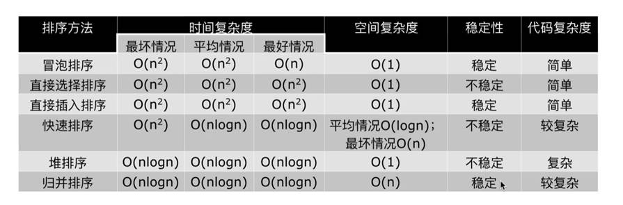

# 算法问题

## 汉诺塔问题

问题描述
>该游戏是在一块铜板装置上，有三根杆(编号A、B、C)，在A杆自下而上、由大到小按顺序放置N个金盘。游戏的目标：把A杆上的金盘全部移到C杆上，并仍保持原有顺序叠好。操作规则：每次只能移动一个盘子，并且在移动过程中三根杆上都始终保持大盘在下，小盘在上，操作过程中盘子可以置于A、B、C任一杆上。
>


盘子数为两个的时候移动步骤
>

盘子数为n个的时候算法步骤
>1 把n-1个盘子由A 移到 B；(C为过渡盘）
>2 把第n个盘子由 A移到 C；
>3 把n-1个盘子由B 移到 C；（A为过渡盘）


## topk问题

topk问题问题描述
>列表里有n个数，找到里面前k个大的数。

快速排序方案
>先用快速排序对列表进行一个排序，然后取前k个大的数。时间复杂度为O（nlogn）

lowb排序三人组方案
>选择lowB排序三人组里的其中一个排序方案。然后不完全的使用这个排序。比如用选择排序，一次排序找到当前无序列表里最大的一个数，一次就得对比n次。找到里面前K个大的数，就只用k次排序即可。时间复杂度为O（kn）

堆排序方案（最优方案）
>
>假设要对该列表取前5个大的数
>
>
>首先取列表5个元素建立一个小根堆，此时堆顶就是第5个大的数。
>
>
>然后遍历该列表后续的元素，依次与堆顶进行对比。小于小根堆则忽略该元素。比如0，小于此时堆顶1则删除。
>
>
>大于该堆顶，就把堆顶删掉，然后将该元素放到堆顶。比如7大于1，则1删除。7放到堆顶
>
>
>然后对这个堆进行一次堆的向下调整。
>然后所有列表里剩下元素都以此为标准进行遍历对比。遍历完后，则排序完成。
>
>最差的时间复杂度为(nlogk)
>这里n为列表长度，k为所构建的堆的总元素。


实现
```
实现
#include<bits/stdc++.h>
using namespace std;

//小根堆版堆的向下调整函数。li为存储二叉树的列表，low二叉树根节点的下标，high二叉树最后一个节点的下标 
void sift(int *li,int low,int high)
{	//i最开始指向根节点的位置 
	int i=low;
	//j是i的左孩子下标。
	int j=2*i+1;
	//temp存储根节点的值。 
	int temp=li[low];
	
	
	while(1)	 
	{
		//j位置有数，则循环继续。
		if(j<=high)
		{
		
			//如果右孩子节点存在，且比左孩子节点大，j更改为右孩子的下标。 
			if(j+1<=high&&li[j]>li[j+1]) ++j; 
			if(li[j]<temp)
			{
				li[i]=li[j];
				i=j;
				j=2*i+1;
			} 
			else
			{
				li[i]=temp;break;
			}
		}
		//j位置无数，则把temp放在叶子节点上 
		else
		{
			li[i]=temp;break;
		}
	
			
	} 
}
//小根堆构造函数,li为列表，n为列表长度 
void dgz(int *li,int n)
{ 
	//j为下标为n-1的节点的父节点，也就是最后一个节点的父节点。j也是最后一个非叶子节点 
	int j=(n-2)/2; 
	
	//这里的i为要调整的二叉树的根节点。 
	for(int i=j;i>=0;i--)
	{
		//这里每次循环执行一次sift,就是将要调整的二叉树调整为堆。 
		//这里拿n-1也就是最后一个节点的下标，作为high，而不是拿要调整的二叉树的最后一个节点的下标作为high。是因为high的作用的本质是在sift函数里的判断j位置是否存在。那么这里可以直接用最后一个节点下标 n-1，依旧可以实现这个作用。就不需要每次循环重新计算要调整的二叉树的最后一个节点的下标。 
		sift(li,i,n-1);
		 
	}
} 


//解决topk问题的函数，li为列表，k表示要找前k个大数，n为列表长度 
void topk(int *li,int k,int n)
{
	//先把列表前k个数构建成小根堆。 
	dgz(li,k); 
	//该循环是将列表后面的元素，以此与堆顶进行比较。 
	for(int i=k;i<=n-1;i++)
	{
		//如果后面元素大于堆顶，就将堆顶删去，并且将元素存入堆顶，然后话做一次堆的向下调整。	 
		if(li[i]>li[0]){
			li[0]=li[i];
			sift(li,0,k-1);
		}
	} 
	
} 
int main()
{
	int a[11]={5,2,1,6,7,8,9,4,3,10,0};
	//找出列表前5个大的数。 
	topk(a,5,11);
	for(int i=0;i<=4;i++)
	{
		cout<<a[i]<<endl;
	}
	
} 
```